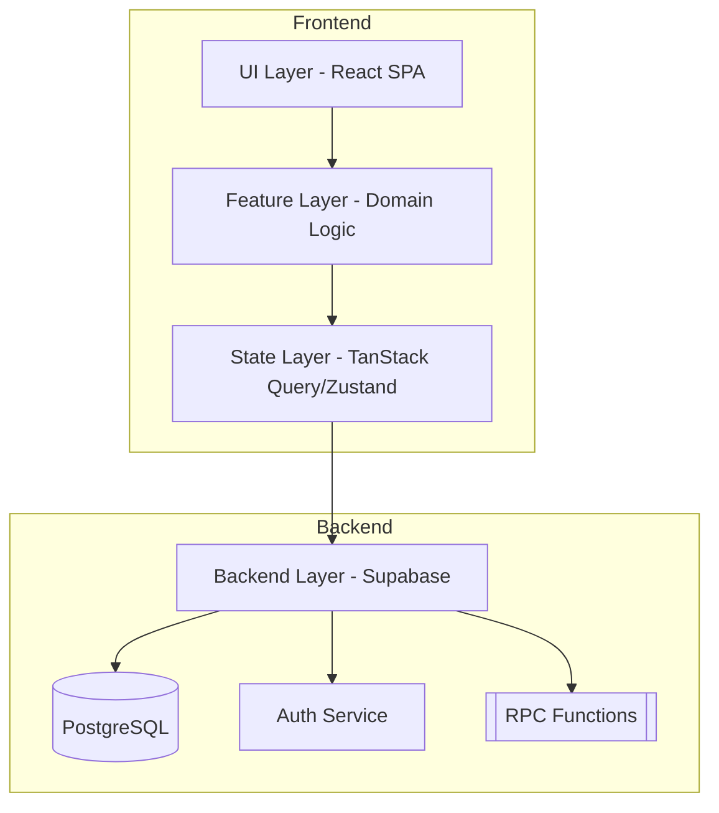
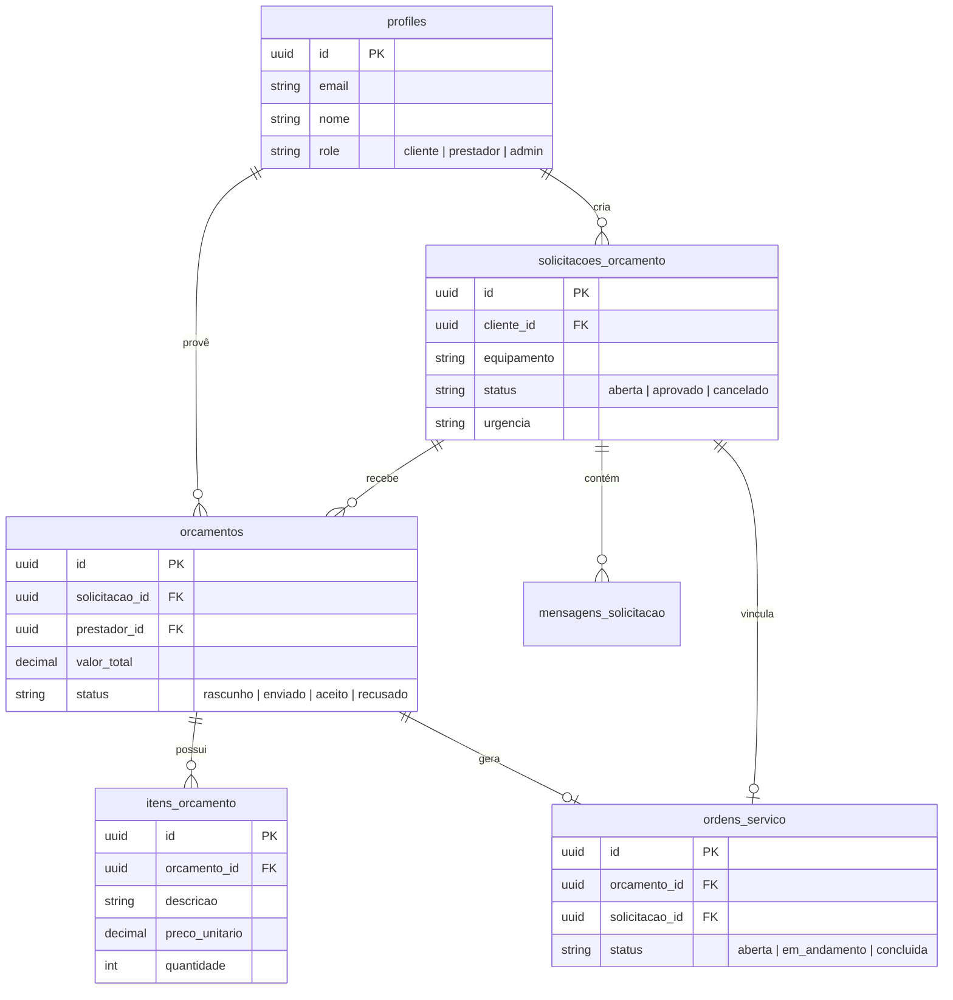
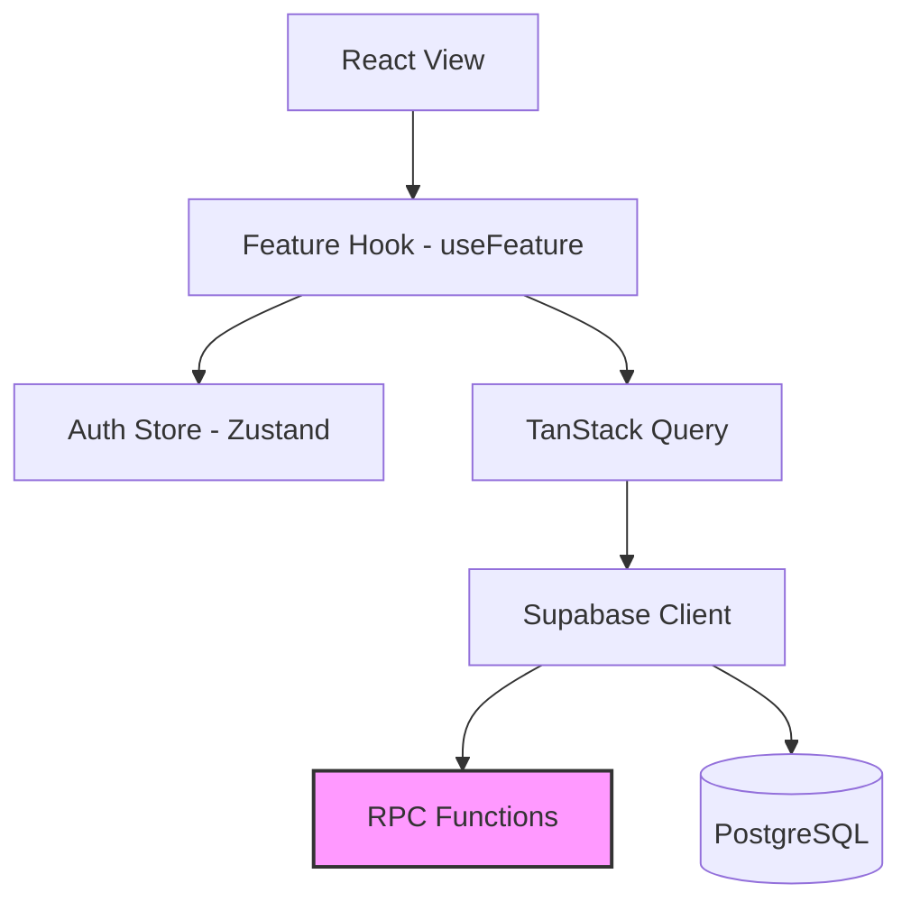
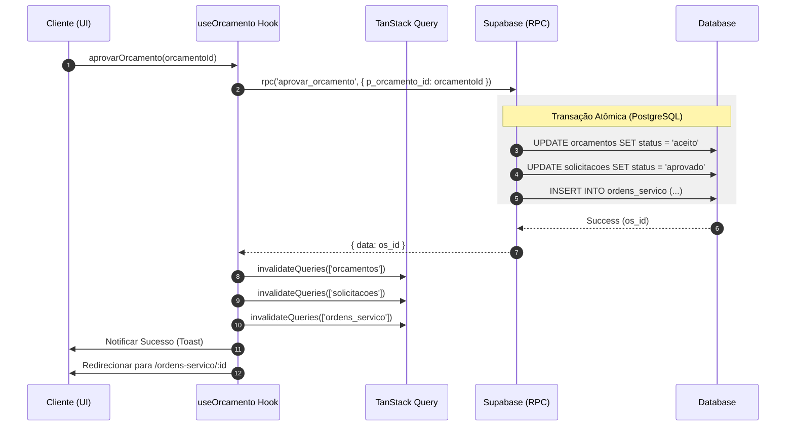
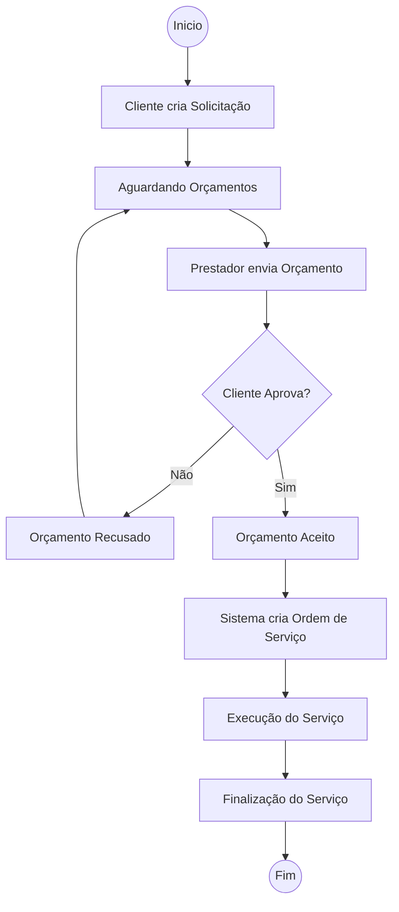
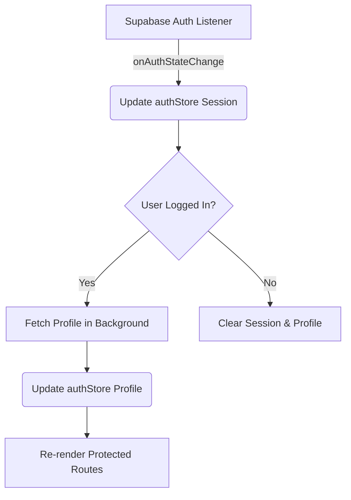

<!-- refreshed: 2025-05-15 -->
# Architecture

**Analysis Date:** 2025-05-15

## System Overview

## Component Responsibilities

| Component | Responsibility | File |
|-----------|----------------|------|
| `App` | Root router and provider setup | `src/App.tsx` |
| `authStore` | Global auth state and profile management | `src/store/authStore.ts` |
| `useAuthStore` | Zustand hook for auth state | `src/store/authStore.ts` |
| `AppShell` | Main authenticated layout shell | `src/components/layout/AppShell.tsx` |
| `ProtectedRoute` | Authentication gate for routes | `src/components/guards/ProtectedRoute.tsx` |
| `RoleGuard` | Role-based access control gate | `src/components/guards/RoleGuard.tsx` |
| `useOrcamento` | Budget domain logic and API calls | `src/features/orcamento/useOrcamento.ts` |
| `useSolicitacao` | Request domain logic and API calls | `src/features/solicitacao/useSolicitacao.ts` |

## Data Model (ERD)

## Pattern Overview

**Overall:** Feature-based SPA with role-based access control (RBAC) and Atomic Design.

**Key Characteristics:**
- **Encapsulated Features**: Domains like `orcamento`, `solicitacao`, and `ordem-servico` are self-contained under `src/features/`.
- **Atomic Design**: Generic UI components are organized into `atoms`, `molecules`, and `organisms` under `src/components/`.
- **Server State Management**: TanStack Query (React Query) is used for all server-side data synchronization and caching.
- **RPC-First Mutations**: Complex operations are offloaded to Supabase PostgreSQL functions (RPCs) to ensure atomicity and security.

## Component Interaction

## Layers

**Auth Layer:**
- Purpose: Session management and role enforcement.
- Location: `src/store/authStore.ts`, `src/components/guards/`.
- Contains: Zustand store, `ProtectedRoute`, `RoleGuard`.
- Depends on: Supabase client (`src/lib/supabase.ts`).
- Used by: `App.tsx` (route wrappers), feature hooks.

**Logic Layer (Hooks):**
- Purpose: Encapsulate domain logic and server state operations.
- Location: `src/features/**/use*.ts`, `src/hooks/`.
- Contains: `useQuery`, `useMutation` implementations.
- Depends on: `src/lib/supabase.ts`, `src/store/authStore.ts`.
- Used by: Page and organism components.

**UI Layer:**
- Purpose: Present data and capture user interaction.
- Location: `src/features/**/Pages.tsx`, `src/components/`.
- Contains: React components, Tailwind styling.
- Depends on: Logic layer hooks, shared components.

## Data Flow

### Budget Approval Flow (Robust)

### Service Lifecycle (Activity Diagram)

### Auth State Flow

**State Management:**
- **Auth**: Zustand (`useAuthStore`) for persistent session and profile.
- **Server State**: TanStack Query for caching domain entities (`orcamentos`, `solicitacoes`, etc.).
- **Local UI State**: `useState` or specialized Zustand stores (e.g., `perfilModalStore`).

## Key Abstractions

**Custom Hooks (useFeature):**
- Purpose: Centralize all API interactions for a feature.
- Examples: `src/features/orcamento/useOrcamento.ts`.

**Route Guards:**
- Purpose: declarative access control.
- Examples: `src/components/guards/RoleGuard.tsx`.

## Entry Points

**Main Entry:**
- Location: `src/main.tsx`
- Responsibilities: Renders the React application and sets up the root provider.

**Router Entry:**
- Location: `src/App.tsx`
- Responsibilities: Defines the component-based routing table and wraps routes in guards and layouts.

## Architectural Constraints

- **Single Entry Point**: All routes must be declared in `src/App.tsx`.
- **Atomic Commits**: Data mutations involving multiple tables must use Supabase RPCs to ensure database integrity.
- **Role Isolation**: Business logic must respect the user role fetched from the `profiles` table.

## Anti-Patterns

### Logic in Components
**What happens:** Placing complex Supabase queries or data transformation directly inside JSX components.
**Why it's wrong:** Harder to test and reuse; breaks the separation of concerns.
**Do this instead:** Move logic to a custom hook in `src/features/{domain}/use{Domain}.ts`.

## Error Handling

**Strategy:** Centralized error boundary for crashes, toast notifications for API failures.

**Patterns:**
- `GlobalErrorBoundary`: Catches React rendering errors.
- `sonner`: Used for user-facing success/error feedback during mutations.
- `parseApiError`: Utility to transform Supabase/PostgREST errors into readable messages.

---

*Architecture analysis: 2025-05-15*
