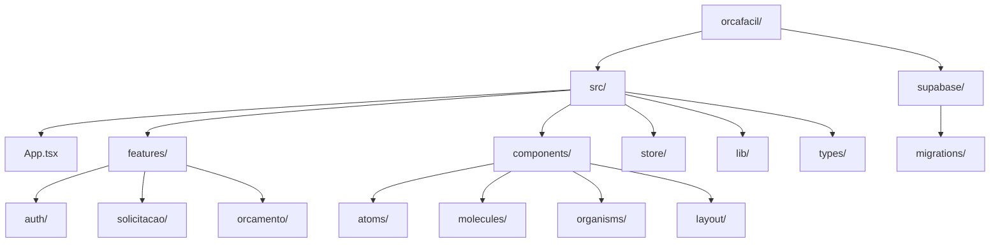

# Codebase Structure

**Analysis Date:** 2025-05-15

## Directory Layout



```
orcafacil/
├── src/
│   ├── App.tsx                  # Route tree, providers, guards
│   ├── main.tsx                 # DOM entry point
│   ├── assets/                  # Static assets (images, icons)
│   ├── components/
│   │   ├── atoms/               # Primitive UI components
│   │   ├── molecules/           # Composite UI components
│   │   ├── organisms/           # Complex UI blocks
│   │   ├── guards/              # ProtectedRoute, RoleGuard
│   │   ├── layout/              # AppShell, Sidebar, TopBar, BottomNav
│   │   ├── pdf/                 # PDF generation components
│   │   └── ui/                  # shadcn/ui primitives
│   ├── features/
│   │   ├── auth/                # Login, Register, useAuth, authSchemas
│   │   ├── solicitacao/         # Solicitacao pages, useSolicitacao, schemas, sub-components
│   │   ├── orcamento/           # Orcamento pages, useOrcamento, schemas
│   │   ├── ordem-servico/       # OS pages, useOrdemServico
│   │   ├── perfil/              # Profile page, usePerfil
│   │   └── notificacoes/        # Notification feature
│   ├── hooks/                   # Shared/global hooks (useSidebar, useBreadcrumb)
│   ├── lib/                     # Utilities, clients, constants
│   ├── pages/                   # Thin shell pages (delegate to features)
│   ├── store/                   # Zustand stores (authStore)
│   └── types/                   # domain.ts, supabase.ts (generated)
├── supabase/
│   └── migrations/              # SQL migration files
│   └── functions/               # Edge functions (if any)
├── docs/
│   └── superpowers/             # Project specs and plans
├── public/                      # Static public assets
├── dist/                        # Build output (gitignored)
├── index.html                   # Vite HTML entry
├── vite.config.ts
├── tailwind.config.ts
├── tsconfig.json
└── package.json
```

## Directory Purposes

**`src/features/`:**
- Purpose: Primary home for all domain logic.
- Contains: Per-feature directories, each with pages, a `use{Feature}.ts` hook, `{feature}Schemas.ts` (Zod).
- Key files: `src/features/solicitacao/useSolicitacao.ts`, `src/features/orcamento/OrcamentoFormPage.tsx`.

**`src/components/atoms/`:**
- Purpose: Smallest reusable UI primitives.
- Contains: `Button.tsx`, `LoadingSkeleton.tsx`, `StatusBadge.tsx`, `EmptyState.tsx`, `ErrorState.tsx`.

**`src/components/organisms/`:**
- Purpose: Complex, self-contained UI blocks.
- Contains: `DataTable.tsx`, `OrcamentoCard.tsx`, `SolicitacaoCard.tsx`, `ItemOrcamentoRow.tsx`.

**`src/components/guards/`:**
- Purpose: Route guard wrapper components.
- Contains: `ProtectedRoute.tsx` (auth check), `RoleGuard.tsx` (role check).

**`src/components/layout/`:**
- Purpose: Persistent authenticated app shell.
- Contains: `AppShell.tsx`, `TopBar.tsx`, `Sidebar.tsx`, `BottomNav.tsx`.

**`src/pages/`:**
- Purpose: Thin shell pages for list/overview views.
- Contains: `DashboardPage.tsx`, `SolicitacoesPage.tsx`, `OrcamentosPage.tsx`, `PerfilPage.tsx`.

**`src/store/`:**
- Purpose: Global client state (Zustand).
- Contains: `authStore.ts` (user, profile, session).

**`src/lib/`:**
- Purpose: Infrastructure utilities and clients.
- Contains: `supabase.ts`, `queryClient.ts`, `utils.ts`, `errorUtils.ts`.

**`src/types/`:**
- Purpose: Shared TypeScript types.
- Contains: `domain.ts` (domain entities), `supabase.ts` (auto-generated DB types).

## Key File Locations

**Entry Points:**
- `src/main.tsx`: DOM render.
- `src/App.tsx`: Full route tree and provider setup.

**Configuration:**
- `vite.config.ts`: Vite build config.
- `tailwind.config.ts`: Tailwind theme config.
- `components.json`: shadcn/ui component config.

**Core Logic:**
- `src/store/authStore.ts`: Auth state + Supabase listener.
- `src/lib/supabase.ts`: Supabase client singleton.
- `src/types/domain.ts`: Domain entity types.

**Guards:**
- `src/components/guards/ProtectedRoute.tsx`: Session gate.
- `src/components/guards/RoleGuard.tsx`: Role gate.

## Naming Conventions

**Files:**
- Pages: `PascalCase` with `Page` suffix — e.g., `OrcamentoFormPage.tsx`.
- Hooks: `camelCase` with `use` prefix — e.g., `useOrcamento.ts`.
- Schemas: `camelCase` with `Schemas` suffix — e.g., `orcamentoSchemas.ts`.
- Components: `PascalCase` — e.g., `StatusBadge.tsx`.
- Types: `PascalCase` with `I` prefix for entities — e.g., `ISolicitacao`.

**Directories:**
- Features: `kebab-case` — e.g., `ordem-servico/`.
- Component categories: `lowercase` — `atoms/`, `molecules/`, `organisms/`.

## Where to Add New Code

**New Feature:**
- Directory: `src/features/{feature-name}/`.
- Logic: `src/features/{feature-name}/use{FeatureName}.ts`.
- UI: `src/features/{feature-name}/{FeatureName}Page.tsx`.

**New Shared Component:**
- Atom: `src/components/atoms/{ComponentName}.tsx`.
- Organism: `src/components/organisms/{ComponentName}.tsx`.

**Utilities:**
- Shared helpers: `src/lib/utils.ts`.

## Special Directories

**`supabase/migrations/`:**
- Purpose: SQL migration history.
- Committed: Yes.

**`src/components/ui/`:**
- Purpose: shadcn/ui generated primitives.
- Committed: Yes (treat as read-only).

---

*Structure analysis: 2025-05-15*
