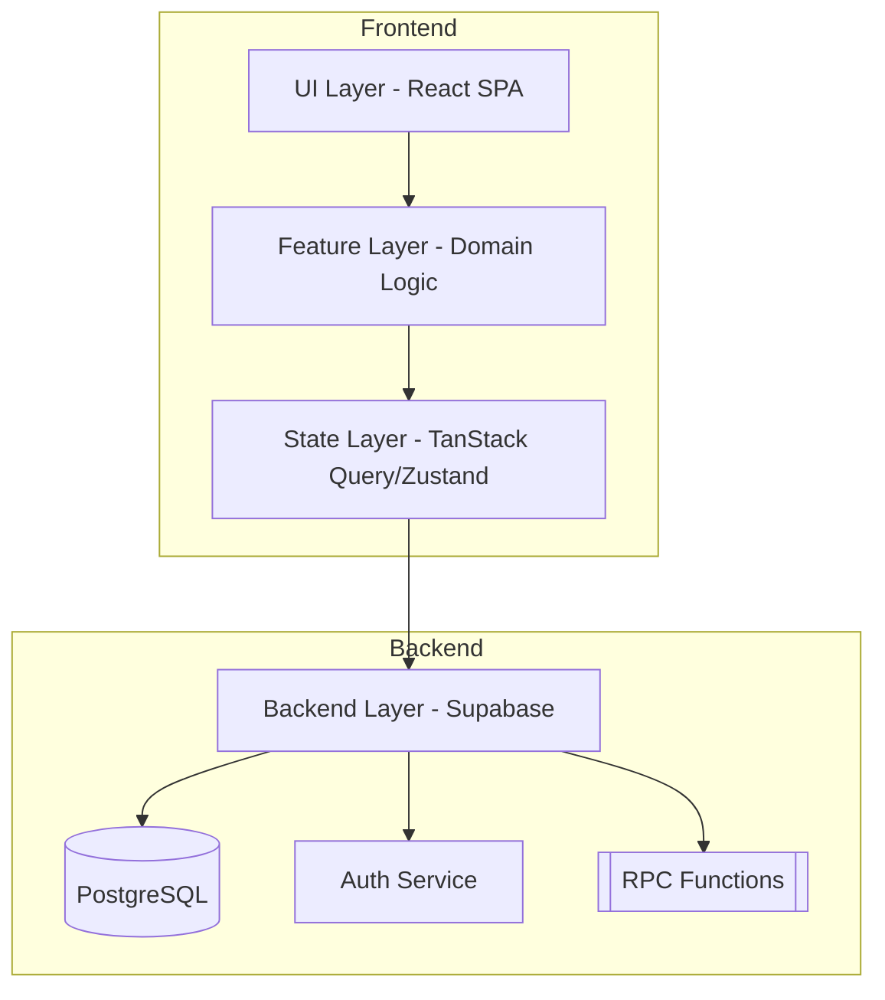
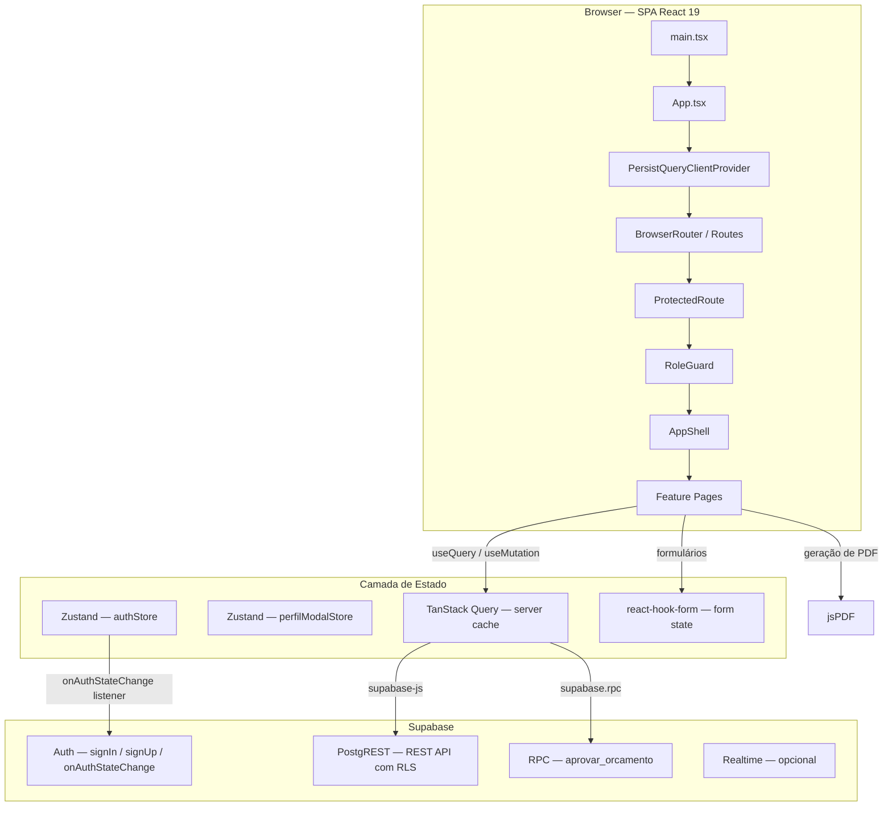
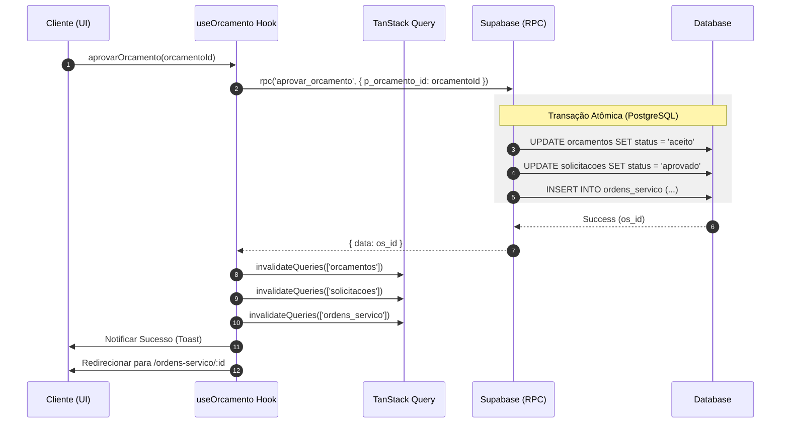
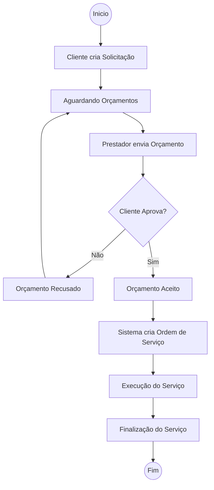
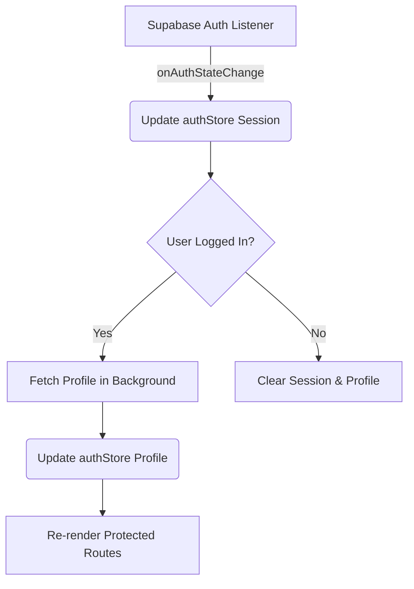
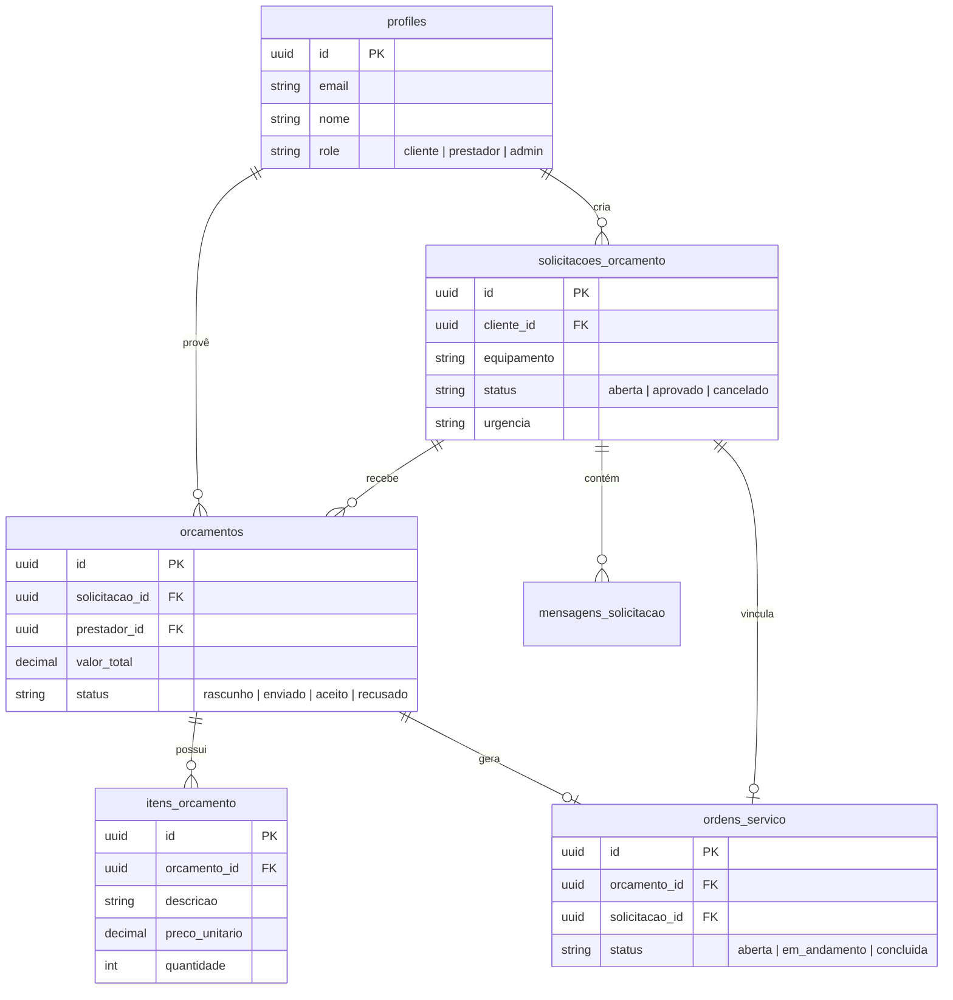

<!-- generated-by: gsd-doc-writer -->
# Arquitetura — CSTI

## Visão Geral do Sistema

CSTI é uma SPA (Single Page Application) React que conecta **clientes** (empresas com equipamentos de TI para manutenção) a **prestadores** (técnicos de TI que elaboram orçamentos). O ciclo completo vai da abertura de uma solicitação de orçamento até a criação de uma Ordem de Serviço, com aprovação atômica via função RPC no Supabase.

A arquitetura segue o modelo **BFF-less**: o frontend conversa diretamente com o Supabase através do SDK `@supabase/supabase-js`. Toda a autorização é imposta no banco de dados via Row Level Security (RLS), eliminando a necessidade de um servidor intermediário de API.



---

## Pattern Overview

**Overall:** Feature-based SPA with role-based access control (RBAC) and Atomic Design.

**Key Characteristics:**
- **Encapsulated Features**: Domains like `orcamento`, `solicitacao`, and `ordem-servico` are self-contained under `src/features/`.
- **Atomic Design**: Generic UI components are organized into `atoms`, `molecules`, and `organisms` under `src/components/`.
- **Server State Management**: TanStack Query (React Query) is used for all server-side data synchronization and caching.
- **RPC-First Mutations**: Complex operations are offloaded to Supabase PostgreSQL functions (RPCs) to ensure atomicity and security.

---

## Diagrama de Componentes (Alto Nível)



---

## Camadas de Responsabilidade

| Componente | Responsabilidade | Localização |
|-----------|----------------|------|
| `App` | Root router and provider setup | `src/App.tsx` |
| `authStore` | Global auth state and profile management | `src/store/authStore.ts` |
| `AppShell` | Main authenticated layout shell | `src/components/layout/AppShell.tsx` |
| `ProtectedRoute` | Authentication gate for routes | `src/components/guards/ProtectedRoute.tsx` |
| `RoleGuard` | Role-based access control gate | `src/components/guards/RoleGuard.tsx` |
| `useOrcamento` | Budget domain logic and API calls | `src/features/orcamento/useOrcamento.ts` |
| `useSolicitacao` | Request domain logic and API calls | `src/features/solicitacao/useSolicitacao.ts` |

---

## Fluxo de Dados e Interações

### 1. Aprovação de Orçamento (Transação Atômica)



### 2. Ciclo de Vida do Serviço



### 3. Gerenciamento de Estado de Autenticação



---

## Modelo de Dados (ERD)



### Dicionário de Dados (Principais Tabelas)

| Tabela | Descrição | Colunas Chave |
|-------|-------------|-------------|
| `profiles` | Perfis de usuário vinculados ao Auth.users | `id`, `nome`, `email`, `role`, `especialidade`, `telefone` |
| `solicitacoes_orcamento` | Pedidos de serviço criados por clientes | `id`, `numero`, `cliente_id`, `titulo`, `descricao`, `status`, `categoria` |
| `orcamentos` | Orçamentos enviados por prestadores | `id`, `numero`, `solicitacao_id`, `prestador_id`, `status`, `prazo_estimado_dias` |
| `itens_orcamento` | Itens de um orçamento específico | `id`, `orcamento_id`, `descricao`, `quantidade`, `valor_unitario`, `tipo` |
| `ordens_servico` | Ordens de serviço geradas após aceite | `id`, `numero`, `orcamento_id`, `cliente_id`, `prestador_id`, `status` |
| `notificacoes` | Notificações do sistema para usuários | `id`, `usuario_id`, `tipo`, `titulo`, `mensagem`, `lida` |
| `status_historico` | Log de auditoria de transições de status | `id`, `tabela_nome`, `registro_id`, `status_anterior`, `status_novo` |

---

## Estrutura de Diretórios (`src/`)

```
src/
├── main.tsx                     # Ponto de entrada — monta StrictMode + App
├── App.tsx                      # Roteamento, providers globais, lazy-loading
├── index.css                    # Tailwind CSS v4 — tokens e variáveis globais
│
├── features/                    # Módulos de negócio (feature-slice)
│   ├── auth/                    # Autenticação: login, cadastro, hooks de auth
│   ├── notificacoes/            # Listagem e leitura de notificações
│   ├── orcamento/               # CRUD de orçamentos, envio e revisão
│   ├── ordem-servico/           # Listagem e detalhe de ordens de serviço
│   ├── perfil/                  # Modal de perfil e edição de dados do usuário
│   └── solicitacao/             # CRUD de solicitações de orçamento
│
├── components/
│   ├── ui/                      # Componentes shadcn/ui (primitivos)
│   ├── atoms/                   # Primitivos sem dependência de domínio (Button, Badge)
│   ├── molecules/               # Composições (PhoneInput, InfoRow, FilterBar)
│   ├── organisms/               # Blocos complexos (DataTable, SolicitacaoCard)
│   ├── layout/                  # AppShell, Sidebar, TopBar, BottomNav
│   ├── guards/                  # ProtectedRoute, RoleGuard
│   └── pdf/                     # Geração de PDF com jsPDF
│
├── lib/                         # Utilitários e clientes singleton
│   ├── supabase.ts              # createClient — cliente Supabase tipado
│   ├── queryClient.ts           # QueryClient + persister localStorage
│   └── phoneUtils.ts            # Utilitários de telefone e máscaras
│
├── store/                       # Stores Zustand globais
│   ├── authStore.ts             # Sessão, usuário e perfil
│   └── perfilModalStore.ts      # Estado de abertura do PerfilModal
│
└── types/                       # Tipos TypeScript
    ├── domain.ts                # Role, ISolicitacao, IOrcamento...
    └── supabase.ts              # Tipos gerados pelo Supabase CLI
```

---

## Stack Tecnológica

| Camada | Tecnologias |
|---|---|
| **Linguagens** | TypeScript, SQL (PL/pgSQL), CSS3 |
| **Frontend** | React 19, Vite, Tailwind CSS 4 |
| **Estado/Dados** | TanStack Query v5, Zustand, React Hook Form, Zod |
| **Backend (BaaS)**| Supabase (Auth, PostgreSQL, RPC, Edge Functions) |
| **UI/UX** | shadcn/ui, Lucide React, Sonner (toasts), React Joyride (onboarding) |
| **Testes** | Vitest, Testing Library, Playwright |
| **Utilidades** | jsPDF (geração de PDF), Recharts (gráficos) |

---

## Roteamento e Acesso

Definido em `src/App.tsx`. Todas as páginas são **lazy-loaded**.

### Árvore de Rotas (Simplificada)

```
/login                              → Público
/cadastro                           → Público

[ProtectedRoute — Requer Sessão]
  /dashboard                        → Dashboard Principal
  /perfil                           → Modal de Perfil (Zustand controlled)
  
  [RoleGuard — role: 'cliente']
    /solicitacoes                   → Gestão de Solicitações
    /orcamentos/:id/revisar         → Revisão de Proposta

  [RoleGuard — role: 'prestador']
    /prestador/solicitacoes         → Marketplace de Demandas
    /prestador/orcamentos/novo      → Elaboração de Proposta
```

---

## Integrações Externas

### Supabase
- **Auth**: Gerenciado via `authStore.ts` e `useAuth`.
- **Database**: PostgreSQL acessado via `supabase-js` com Row Level Security (RLS) habilitado em todas as tabelas.
- **RPC**: Funções atômicas como `aprovar_orcamento` para garantir integridade.

### Sistema de Onboarding
- **Biblioteca**: `react-joyride`.
- **Funcionamento**: Monitora mudanças de rota e usa `MutationObserver` para disparar tours guiados baseados no papel do usuário (`cliente` ou `prestador`).

### Geração de PDF
- **Biblioteca**: `jsPDF`.
- **Fluxo**: Geração puramente client-side em `src/components/pdf/PdfGenerator.ts`.
