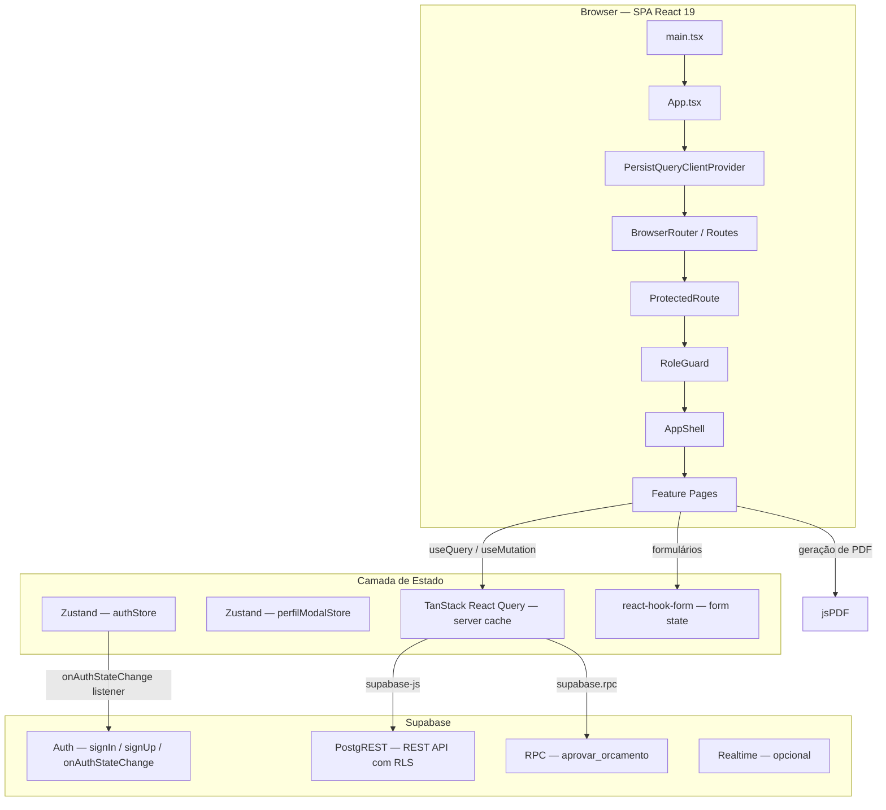

<!-- generated-by: gsd-doc-writer -->

# Arquitetura — OrçaFácil

## Visão Geral do Sistema

OrçaFácil é uma SPA (Single Page Application) React que conecta **clientes** (empresas com equipamentos de TI para manutenção) a **prestadores** (técnicos de TI que elaboram orçamentos). O ciclo completo vai da abertura de uma solicitação de orçamento até a criação de uma Ordem de Serviço, com aprovação atômica via função RPC no Supabase.

A arquitetura segue o modelo **BFF-less**: o frontend conversa diretamente com o Supabase através do SDK `@supabase/supabase-js`. Toda a autorização é imposta no banco de dados via Row Level Security (RLS), eliminando a necessidade de um servidor intermediário de API.

---

## Diagrama de Alto Nível



---

## Estrutura de Diretórios (`src/`)

```
src/
├── main.tsx                     # Ponto de entrada — monta StrictMode + App
├── App.tsx                      # Roteamento, providers globais, lazy-loading
├── index.css                    # Tailwind CSS v4 — tokens e variáveis globais
│
├── assets/                      # Imagens e recursos estáticos
│
├── features/                    # Módulos de negócio (feature-slice)
│   ├── auth/                    # Autenticação: login, cadastro, hooks de auth
│   ├── notificacoes/            # Listagem e leitura de notificações
│   ├── orcamento/               # CRUD de orçamentos, envio e revisão
│   ├── ordem-servico/           # Listagem e detalhe de ordens de serviço
│   ├── perfil/                  # Modal de perfil e edição de dados do usuário
│   └── solicitacao/             # CRUD de solicitações de orçamento
│
├── components/
│   ├── ui/                      # Componentes shadcn/ui (gerados via CLI shadcn)
│   ├── atoms/                   # Primitivos sem dependência de domínio
│   ├── molecules/               # Composições de atoms + lógica local
│   ├── organisms/               # Blocos complexos (tabelas, cards de lista)
│   ├── layout/                  # AppShell, Sidebar, TopBar, BottomNav
│   ├── guards/                  # ProtectedRoute, RoleGuard
│   └── pdf/                     # Geração de PDF com jsPDF
│
├── hooks/                       # Hooks compartilhados (useBreadcrumb, useSidebar)
├── lib/                         # Utilitários e clientes singleton
│   ├── supabase.ts              # createClient — cliente Supabase tipado
│   ├── queryClient.ts           # QueryClient + persister localStorage
│   ├── analytics.ts             # track() / trackError()
│   ├── constants.ts             # Constantes de domínio
│   ├── dateUtils.ts             # Formatadores de data
│   ├── errorUtils.ts            # parseApiError()
│   ├── greeting.ts              # Saudação contextual por horário
│   ├── metricsUtils.ts          # Cálculos de métricas do dashboard
│   ├── phoneUtils.ts            # COUNTRIES, formatBRPhone, parseStoredPhone
│   └── utils.ts                 # cn() e helpers gerais
│
├── pages/                       # Páginas genéricas (não vinculadas a uma única feature)
│   ├── DashboardPage.tsx
│   ├── OrcamentosPage.tsx
│   ├── SolicitacoesPage.tsx
│   ├── PerfilPage.tsx
│   ├── NotificacoesPage.tsx
│   ├── LoginPage.tsx            # Alias — renderiza features/auth/LoginPage
│   ├── RegisterPage.tsx
│   └── OnboardingWelcome.tsx
│
├── store/                       # Stores Zustand globais
│   ├── authStore.ts             # Sessão, usuário e perfil
│   └── perfilModalStore.ts      # Estado de abertura do PerfilModal
│
└── types/                       # Tipos TypeScript
    ├── domain.ts                # Role, ISolicitacao, IOrcamento, IOrdemServico…
    └── supabase.ts              # Tipos gerados pelo Supabase CLI (Database)
```

---

## Arquitetura Feature-Slice

Cada módulo em `src/features/` é autônomo e segue a convenção:

```
features/<nome>/
├── <NomePage>.tsx           # Componente de página principal (lazy-loaded em App.tsx)
├── <Nome>FormDialog.tsx     # Formulários modais quando aplicável
├── <Nome>DetailPage.tsx     # Página de detalhe
├── use<Nome>.ts             # Hooks React Query para operações CRUD
├── <nome>Schemas.ts         # Schemas Zod para validação de formulários
├── components/              # Componentes internos (apenas neste feature)
│   └── __tests__/
└── __tests__/               # Testes unitários e de integração do feature
```

**Regra:** componentes dentro de `features/<nome>/components/` são privados ao feature. Nunca importar de um feature para outro — compartilhar apenas via `src/components/` ou `src/lib/`.

---

## Camadas de Componentes

A hierarquia garante que dependências sempre fluam de cima para baixo:

```
ui (shadcn/ui)
    ↓
atoms           → Primitivos reutilizáveis sem conhecimento de domínio
    ↓              Ex: LoadingSkeleton, StatusBadge, CurrencyDisplay
molecules       → Composições de atoms + lógica local
    ↓              Ex: PhoneInput, InfoRow, FormField, FilterBar
organisms       → Blocos de UI complexos, podem chamar hooks de domínio
    ↓              Ex: SolicitacaoCard, OrcamentoCard, DataTable
layout          → Estrutura global da aplicação
    ↓              Ex: AppShell, Sidebar, TopBar, BottomNav
guards          → Controle de acesso declarativo
                   Ex: ProtectedRoute, RoleGuard
```

### Componentes Obrigatórios (convenção do projeto)

| Componente | Localização | Uso |
|---|---|---|
| `<PhoneInput>` | `molecules/PhoneInput` | Sempre usar para campos telefone — nunca recriar inline |
| `<InfoRow>` | `molecules/InfoRow` | Exibição read-only de label/valor em telas de configuração |
| `phoneUtils` | `lib/phoneUtils` | `parseStoredPhone`, `buildStoredPhone`, `COUNTRIES` |
| `usePerfilModal` | `store/perfilModalStore` | Abrir PerfilModal — nunca navegar para `/perfil` diretamente |

O padrão de telas de configuração é **read-only por padrão + edit mode**: dados exibidos como `<InfoRow>`, ativando formulário somente ao clicar "Editar".

### shadcn/ui (`components/ui/`)

Configurado em `components.json` com:
- **Estilo:** `base-nova`
- **Base color:** `neutral`
- **CSS variables:** ativado
- **Icon library:** `lucide`
- **Alias:** `@/components/ui`

Componentes são adicionados via `npx shadcn add <componente>` e não devem ser editados manualmente.

---

## Estratégia de Estado

### 1. Zustand — Estado do cliente

| Store | Responsabilidade |
|---|---|
| `authStore` | Sessão Supabase, objeto `User`, `IProfile`, `clearSession` |
| `perfilModalStore` | `isOpen`, `open()`, `close()` do modal de perfil |

O `authStore` registra um listener singleton via `supabase.auth.onAuthStateChange` que atualiza o store em tempo real. Por design, a sessão é liberada imediatamente no evento `SIGNED_IN` e o perfil é buscado em background para evitar bounce no `ProtectedRoute`.

### 2. TanStack React Query v5 — Cache do servidor

- **staleTime:** 5 minutos (dados considerados frescos por 5 min sem refetch)
- **retry:** 1 tentativa em caso de erro
- **refetchOnWindowFocus:** desabilitado
- **Persistência:** `createSyncStoragePersister` grava o cache no `localStorage` via `PersistQueryClientProvider`

Convenção de query keys:
```ts
['solicitacoes']           // lista
['solicitacoes', id]       // item único
['solicitacoes', 'prestador', 'pendentes']  // lista filtrada por papel
['orcamentos', 'cliente']
['orcamentos', 'prestador']
['orcamentos', id]
['ordens-servico']
['ordens-servico', id]
```

### 3. react-hook-form + Zod — Estado de formulários

Cada feature mantém seus schemas em `<nome>Schemas.ts`. Os resolvers são configurados com `@hookform/resolvers/zod`. Formulários nunca persistem estado no Zustand — são locais ao componente.

---

## Camada de Dados — Supabase

### Inicialização do cliente

```ts
// src/lib/supabase.ts
export const supabase = createClient<Database>(
  import.meta.env.VITE_SUPABASE_URL,
  import.meta.env.VITE_SUPABASE_ANON_KEY,
  { auth: { persistSession: true, autoRefreshToken: true, storage: localStorage } }
)
```

### Modelo de dados (migrations em `supabase/migrations/`)

| Tabela | Descrição |
|---|---|
| `profiles` | Usuários do sistema (id = auth.users.id), com campo `role: 'cliente' | 'prestador'` |
| `solicitacoes_orcamento` | Solicitações abertas pelo cliente, numeradas como `SOL-YYYY-NNNN` |
| `orcamentos` | Orçamentos criados pelo prestador para uma solicitação, numerados `ORC-YYYY-NNNN` |
| `itens_orcamento` | Linhas do orçamento; `valor_total` é coluna gerada (`quantidade × valor_unitario`) |
| `ordens_servico` | Criadas atomicamente ao aprovar um orçamento, numeradas `OS-YYYY-NNNN` |
| `status_historico` | Audit trail de mudanças de status, populado por triggers |

### Row Level Security (RLS)

RLS está habilitado em todas as tabelas. Regras principais:

- **profiles:** usuário acessa apenas seu próprio registro
- **solicitacoes_orcamento:** cliente tem CRUD completo nas próprias; prestador tem SELECT apenas nas solicitações para as quais tem um orçamento
- **orcamentos:** prestador tem CRUD completo nos próprios; cliente tem SELECT nos orçamentos de suas solicitações
- **itens_orcamento:** herdado via `orcamento_id` — mesmas regras de prestador/cliente
- **ordens_servico:** SELECT por `cliente_id` ou `prestador_id`; INSERT exclusivo via `SECURITY DEFINER` (função `aprovar_orcamento`)
- **status_historico:** SELECT apenas para registros relacionados ao usuário autenticado

### Função RPC atômica: `aprovar_orcamento`

A aprovação de orçamento é a única operação com múltiplas escritas que precisa ser atômica. Ela é implementada como função PostgreSQL `SECURITY DEFINER`:

```sql
-- supabase/migrations/20260429000003_aprovar_orcamento_fn.sql
CREATE OR REPLACE FUNCTION aprovar_orcamento(p_orcamento_id UUID)
RETURNS UUID AS $$
BEGIN
  -- 1. Valida e bloqueia row do orçamento (FOR UPDATE)
  -- 2. Atualiza orcamentos → status = 'aceito'
  -- 3. Atualiza solicitacoes_orcamento → status = 'aprovado'
  -- 4. Insere registro em ordens_servico
  -- Retorna o UUID da OS criada
END;
$$ LANGUAGE plpgsql SECURITY DEFINER;
```

Chamada no frontend via `supabase.rpc('aprovar_orcamento', { p_orcamento_id })`.

---

## Roteamento

Definido em `src/App.tsx` com `react-router-dom v7`. Todas as páginas são **lazy-loaded** com `React.lazy` + `<Suspense>` para code-splitting automático.

### Árvore de rotas

```
/login                              → LoginPage (público)
/cadastro                           → RegisterPage (público)

[ProtectedRoute — requer session]
  [OnboardingWelcome + AppShell]
    /                               → redirect → /dashboard
    /dashboard                      → DashboardPage
    /notificacoes                   → NotificacoesPage
    /orcamentos/*                   → OrcamentosPage
    /ordens-servico                 → OrdemServicoListPage
    /ordens-servico/:id             → OrdemServicoDetailPage
    /perfil                         → PerfilPage

    [RoleGuard — role: 'cliente']
      /solicitacoes                 → SolicitacoesPage
        /solicitacoes/nova          → SolicitacaoFormDialog (outlet)
        /solicitacoes/:id           → SolicitacaoDetailDialog (outlet)
      /orcamentos/:id/revisar       → OrcamentoReviewPage

    [RoleGuard — role: 'prestador']
      /prestador/solicitacoes       → SolicitacaoListPrestadorPage
        /prestador/solicitacoes/:id → SolicitacaoDetailDialog (outlet)
      /prestador/orcamentos/novo/:solicitacaoId → OrcamentoFormPage
      /prestador/orcamentos/:id                → OrcamentoDetailPage
      /prestador/orcamentos/:id/editar         → OrcamentoFormPage

* → redirect → /dashboard
```

---

## Fluxo de Autenticação

```
1. Usuário preenche login → useAuth().login() → supabase.auth.signInWithPassword()
2. Supabase dispara onAuthStateChange(SIGNED_IN, session)
3. authStore.setSession(user, null, session)   ← UI liberada imediatamente
4. Background: supabase.from('profiles').select('*').eq('id', user.id)
5. authStore.setProfile(data)                  ← perfil disponível para RoleGuard
6. ProtectedRoute detecta session → renderiza rotas protegidas
7. RoleGuard lê profile.role → permite ou redireciona

Logout:
1. supabase.auth.signOut()
2. onAuthStateChange(SIGNED_OUT)
3. authStore.clearSession() → ProtectedRoute redireciona para /login
```

**Cadastro** (`useAuth().register()`):
1. `supabase.auth.signUp()` cria o usuário em `auth.users`
2. Trigger `trg_handle_new_user` insere um perfil mínimo em `profiles`
3. `supabase.from('profiles').upsert()` completa os dados do perfil com `nome`, `role`, `telefone`
4. Navega para `/login` com mensagem de confirmação

---

## Geração de PDF

Localização: `src/components/pdf/`

| Arquivo | Responsabilidade |
|---|---|
| `PdfGenerator.ts` | Função `generateOrcamentoPdf(orcamento, itens, prestador)` — usa jsPDF diretamente |
| `PdfDownloadButton.tsx` | Botão que chama `generateOrcamentoPdf` e dispara `doc.save()` |

O PDF gerado inclui:
- Cabeçalho com dados do prestador (nome, especialidade, telefone)
- Tabela de itens (descrição, quantidade, valor unitário, total)
- Total geral em BRL (`Intl.NumberFormat pt-BR`)
- Marca d'água "PENDENTE DE APROVAÇÃO" quando `status === 'enviado'`

Não há dependência de servidor — a geração ocorre inteiramente no browser.

---

## Build e Bundling

Configurado em `vite.config.ts` com `@vitejs/plugin-react` e `@tailwindcss/vite`. O alias `@` aponta para `src/`.

**Chunks manuais para otimização de cache:**

| Chunk | Conteúdo |
|---|---|
| `vendor-react` | react, react-dom, react-router-dom |
| `vendor-query` | @tanstack/react-query + persist |
| `vendor-supabase` | @supabase/supabase-js |
| `vendor-ui` | lucide-react, @base-ui/react, @radix-ui/* |
| `vendor-forms` | react-hook-form, @hookform/resolvers, zod |

**Variáveis de ambiente necessárias:**

| Variável | Descrição |
|---|---|
| `VITE_SUPABASE_URL` | URL do projeto Supabase |
| `VITE_SUPABASE_ANON_KEY` | Chave anônima pública do Supabase |

---

## Testes

| Ferramenta | Escopo |
|---|---|
| **Vitest** + jsdom | Testes unitários e de componentes — `npm test` |
| **@testing-library/react** | Renderização e interações em testes unitários |
| **Playwright** | Testes end-to-end — `npm run test:e2e` |

Cada feature e camada de componente mantém seus testes em `__tests__/` ao lado dos arquivos que testam. Configuração em `vite.config.ts` (seção `test`) e setup global em `vitest.setup.ts`.
